# AutoForge — Phase 1 Product Requirements Document

**Project:** AutoForge
**Institution:** Government Engineering College, Ajmer — Department of CSE/IT
**Program:** 7th Semester, Project-I
**Duration:** 16 Weeks (July – December 2026)
**Phase:** 1

**Team:**
- Dhruv Vasvani
- Birendra Nagar
- Abhishek Vijayvargiya
- Kartik Sharma

---

## 1. Problem Statement

When developers push code to GitHub, security scanning tools generate a large volume of alerts. Among these alerts:

- Many are **false positives**
- Many refer to **dead or unreachable code**
- Many are **low-priority vulnerabilities**
- Genuine, high-severity issues get **buried** among the noise

This causes **alert fatigue**, and developers spend disproportionate time separating real security issues from noise. Existing AI-based tools can suggest fixes, but without verifying code reachability and context first, an AI-generated fix can silently break the application.

## 2. Product Vision

AutoForge is an intelligent, AI-powered DevSecOps platform that automatically scans GitHub repositories, analyzes and prioritizes security alerts, filters out dead-code/false-positive noise, generates AI-based secure fixes, and opens GitHub Pull Requests — end to end, with no manual triage required.

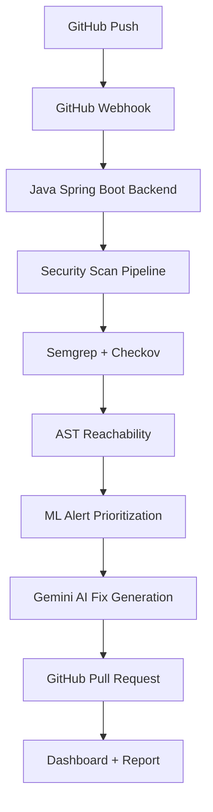

## 3. Main Objectives

1. Automate security scanning across pushed repositories
2. Reduce false-positive and dead-code alerts
3. Prioritize genuinely important vulnerabilities
4. Provide AI-generated, context-verified fixes
5. Automatically create GitHub Pull Requests for fixes
6. Give developers real-time security visibility
7. Generate downloadable security reports
8. Support user and admin account management
9. Handle large repositories reliably
10. Provide a scalable, Java Spring Boot–based backend

## 4. Phase 1 — Scope

### 4.1 User Registration and Login
- Users can register, log in, and receive a JWT token
- JWT-authenticated users can access protected APIs and view their profile
- **Auth stack:** Spring Security + JWT

### 4.2 User Plans

| Plan | Behavior |
|---|---|
| **Free** | Limited repository pushes/scans allowed |
| **Paid** | Not activated via a payment gateway in Phase 1 |

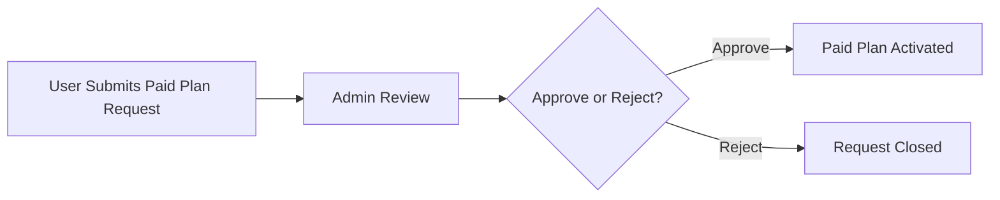

### 4.3 Admin Panel

Admins can:
- View all users and user details
- Activate, pause, or delete users
- Change user limits
- View, approve, or reject paid-plan requests

Faculty members may be granted Admin access for evaluation purposes.

## 5. GitHub Integration

AutoForge integrates with GitHub via webhooks triggered on every push.

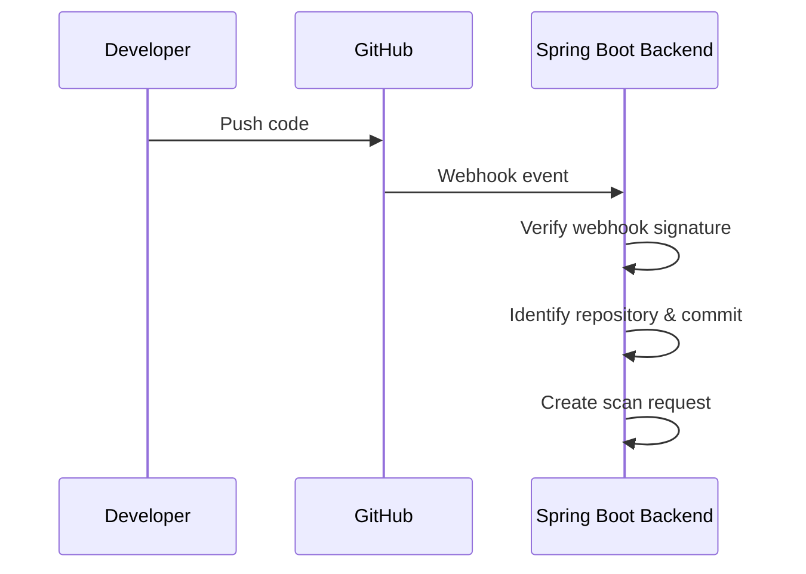

Webhook security relies on GitHub's signature verification.

## 6. Security Scanning

Phase 1 uses two primary scanners:

- **Semgrep** — identifies vulnerabilities in application source code
- **Checkov** — scans Infrastructure-as-Code files (Terraform, Kubernetes configs, cloud infrastructure configuration)

Results from both scanners are stored and processed through the backend.

## 7. AST Reachability Engine

Determines whether a flagged vulnerability sits in code that is actually reachable/used, to cut down on dead-code noise.

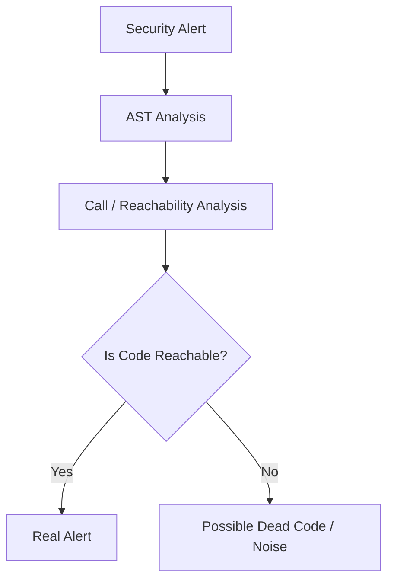

## 8. Machine Learning Alert Prioritization

Remaining (reachable) vulnerabilities are scored and ranked by a Python + scikit-learn model, using:

- Severity
- Reachability
- Vulnerability type
- File context
- Repository context
- Previous scan history

**Priority tiers:** `CRITICAL` → `HIGH` → `MEDIUM` → `LOW`

## 9. AI Fix Generation

Only filtered, prioritized vulnerabilities reach the AI fix stage — unnecessary alerts are never sent to the model.

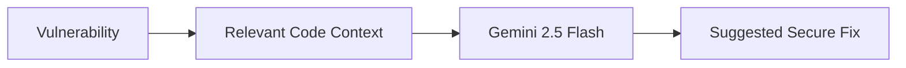

## 10. Automatic Pull Request

After a fix passes validation, AutoForge opens a PR automatically.

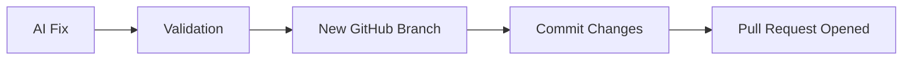

## 11. Dashboard

A React-based dashboard surfaces:

- Repository info, scan status, vulnerability counts, severity distribution
- Vulnerability list with filtering, sorting, and search
- Scan history, fix status, PR status

## 12. Real-Time Logs

Live scan progress streams to the dashboard over WebSockets, e.g.:

```
10:31:02  Webhook received
10:31:03  Repository identified
10:31:05  Scan started
10:31:18  Semgrep completed
10:31:27  Checkov completed
10:31:34  AST analysis completed
10:31:42  ML prioritization completed
10:31:55  AI fix generated
10:32:04  Pull Request created
```

## 13. Vulnerability Heatmaps

Visualizations covering severity distribution, repository-wise and file-wise vulnerability density, scan-wise breakdowns, and trend-over-time views.

## 14. PDF Security Reports

Generated after each scan; downloadable by the user. Includes repository/commit/scan-date metadata, vulnerability counts by severity, filtered/prioritized alert lists, AI-generated fixes, and PR information.

## 15. Backend Architecture

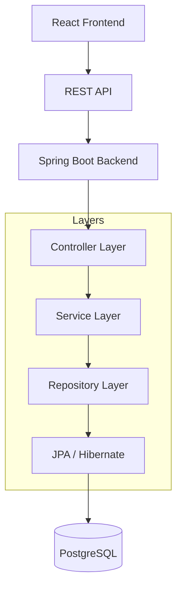

Backend responsibilities: authentication, authorization, user/plan/repository/scan/vulnerability management, GitHub webhook handling, business logic, database operations, report access, and admin operations.

## 16. Database Architecture

**Primary DB:** PostgreSQL | **ORM:** Spring Data JPA + Hibernate

**Core entities:** User, Repository, Scan, Vulnerability, Fix, PullRequest, Report, Plan, PlanRequest, WebhookEvent, AuditLog

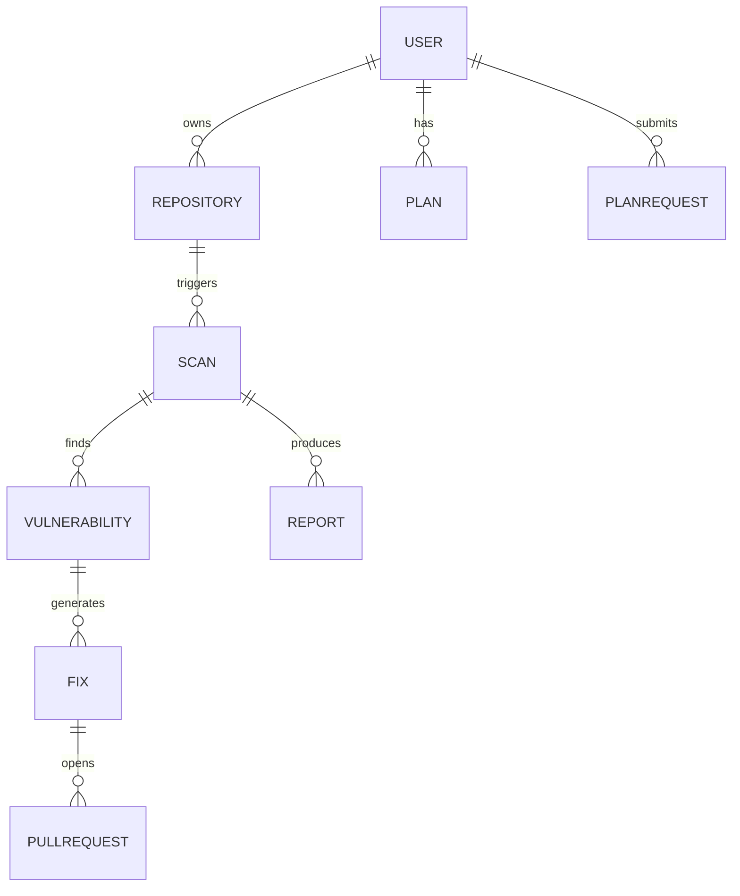

## 17. REST API Architecture

| Domain | Endpoints |
|---|---|
| **Auth** | `POST /api/auth/register`, `POST /api/auth/login` |
| **User** | `GET /api/users/me`, `PUT /api/users/me` |
| **Repository** | `POST /api/repositories`, `GET /api/repositories`, `GET /api/repositories/{id}`, `DELETE /api/repositories/{id}` |
| **Scan** | `POST /api/repositories/{id}/scans`, `GET /api/scans`, `GET /api/scans/{id}` |
| **Vulnerabilities** | `GET /api/scans/{id}/vulnerabilities`, `GET /api/vulnerabilities/{id}`, `PATCH /api/vulnerabilities/{id}/status` |
| **Admin** | `GET /api/admin/users`, `PATCH /api/admin/users/{id}/status`, `PATCH /api/admin/users/{id}/limit`, `DELETE /api/admin/users/{id}` |
| **Plan** | `POST /api/plans/request`, `GET /api/admin/plan-requests`, `PATCH /api/admin/plan-requests/{id}/approve`, `PATCH /api/admin/plan-requests/{id}/reject` |
| **GitHub** | `POST /api/webhooks/github` |
| **Reports** | `GET /api/scans/{id}/report` |

## 18. Technology Stack

| Layer | Technology |
|---|---|
| Language | Java 17 |
| Backend Framework | Spring Boot 3.x |
| REST API | Spring Web / Spring MVC |
| Security | Spring Security + JWT |
| ORM | Spring Data JPA + Hibernate |
| Database | PostgreSQL |
| Validation | Jakarta Bean Validation |
| API Docs | Springdoc OpenAPI / Swagger |
| Exception Handling | Spring `@RestControllerAdvice` |
| Build Tool | Maven |
| Logging | SLF4J + Logback |
| Monitoring | Spring Boot Actuator |
| Source Code Scanning | Semgrep |
| IaC Scanning | Checkov |
| AST Reachability | tree-sitter / AST-based service |
| ML Prioritization | Python + scikit-learn |
| AI Fix Generation | Google Gemini 2.5 Flash |
| GitHub Integration | GitHub REST API / Webhooks |
| Background Processing | Redis + Worker Services |
| Frontend | React + Vite + Tailwind CSS |
| Real-Time | WebSockets |
| Charts | Chart.js / Recharts |
| Containerization | Docker + Docker Compose |

Specialized AST, ML, and security-analysis components run as separate services, keeping the primary application backend Java-based while letting each specialized component use the ecosystem best suited to it.

## 19. Background Processing

Heavy scans never run synchronously inside a request thread.

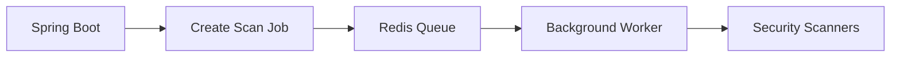

## 20. Docker & Deployment

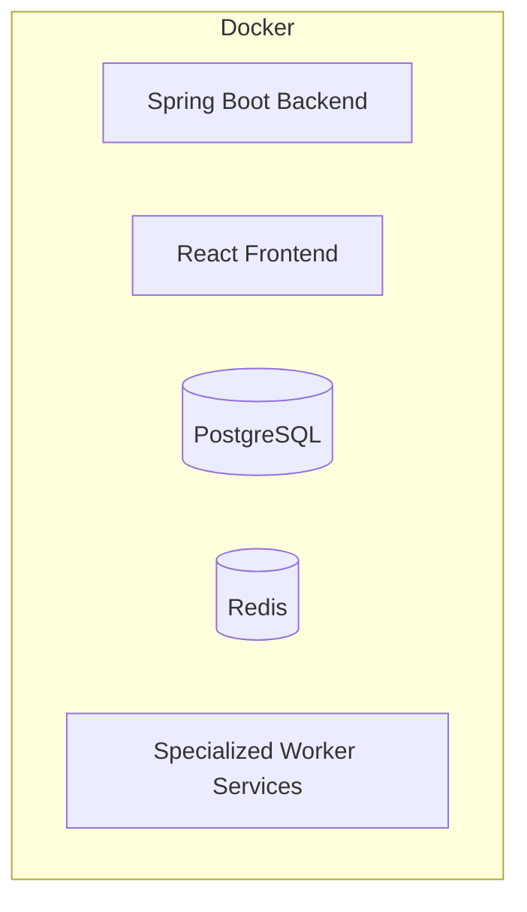

Docker Compose manages the local development environment.

## 21. Out of Scope — Phase 1

| Feature | Reason Deferred |
|---|---|
| Trivy | Semgrep + Checkov already cover scanning needs; a third scanner adds unnecessary complexity |
| Docker Sandbox + Self-Healing | Reserved for Phase 2 |
| Real Payment Gateway (Razorpay/Stripe) | Paid plans use admin approval instead |

## 22. User Roles

**Normal User:** register, log in, use free plan, request paid plan, add repositories, start/view scans, view vulnerabilities, view own dashboard, download PDF reports.

**Admin:** view/pause/activate/delete users, change limits, view/approve/reject paid-plan requests.

**Faculty:** may receive Admin access for project evaluation.

## 23. Complete System Flow

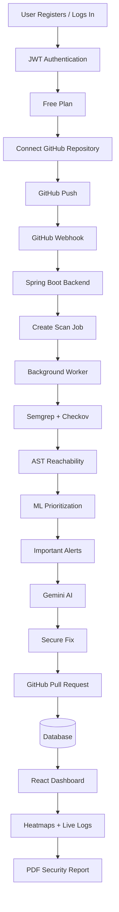

## 24. Timeline — 16 Weeks

| Weeks | Work |
|---|---|
| 1–3 | Research, requirements, architecture, Spring Boot setup, database design |
| 4–5 | User registration, login, JWT, Spring Security |
| 6 | PostgreSQL + JPA/Hibernate + User/Plan modules |
| 7–8 | Admin Panel APIs + User/Plan management |
| 9 | Repository APIs + GitHub integration |
| 10 | GitHub webhook + security verification |
| 11 | Scan management + Semgrep + Checkov integration |
| 12 | AST reachability integration |
| 13 | ML alert prioritization |
| 14 | Gemini fix generation + GitHub PR |
| 15 | Dashboard + WebSockets + heatmaps |
| 16 | PDF reports + testing + optimization + final demo |

## 25. Success Metrics

- **False alert reduction:** ~60–70%
- **Repository scale target:** at least 50,000 lines of code
- **Processing time:** commit → PR within ~3 minutes, where practical for the supported workload
- **Dashboard:** correctly displays vulnerabilities, severity, heatmaps, scan status, live logs
- **Admin:** can manage users, change limits, pause/activate users, approve/reject paid requests

## 26. Testing Requirements

Unit, service, controller/API, authentication, authorization, database integration, webhook-verification, and error-handling tests — using JUnit 5, Mockito, Spring Boot Test, and MockMvc.

## 27. Code Quality Requirements

Clean layered architecture; SOLID principles; DTO-based API design; constructor dependency injection; centralized exception handling; input validation; secure password storage; JWT-based auth; role-based authorization; proper DB relationships; pagination for large datasets; logging; environment-based configuration; no hardcoded secrets.

## 28. Phase 1 Final Deliverables

Java Spring Boot backend · PostgreSQL database · JWT authentication · user management · free/paid plan system · admin management · GitHub webhook · Semgrep integration · Checkov integration · AST reachability · ML prioritization · Gemini AI fix generation · automatic GitHub Pull Requests · React dashboard · real-time logs · vulnerability heatmaps · PDF security reports · Docker-based dev environment · testing and documentation.

## 29. Final Architecture

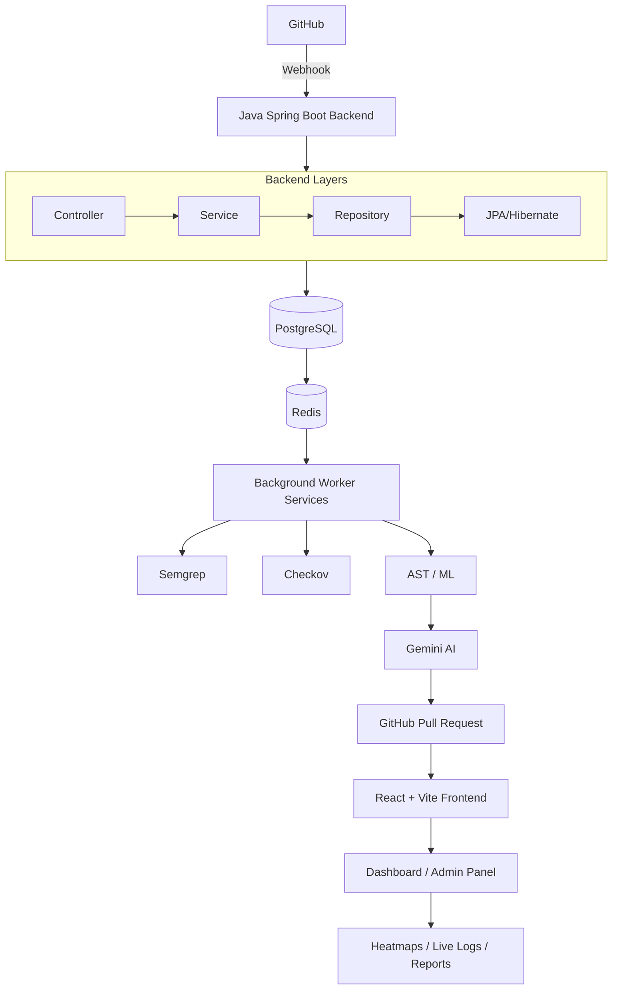

## 30. Final Project Summary

AutoForge is an AI-powered DevSecOps platform that automatically scans GitHub repositories, analyzes security alerts, filters out unnecessary/dead-code noise, prioritizes genuine vulnerabilities, generates AI-powered fixes, and creates GitHub Pull Requests for verified fixes.

The primary application backend is built in **Java + Spring Boot**, handling user management, authentication, authorization, REST APIs, database operations, repository management, scan management, GitHub webhook handling, business logic, and system integration. Specialized AST, ML, and security-analysis components integrate as separate services. This architecture positions AutoForge as a scalable, modular, production-oriented Java Full-Stack + DevSecOps project.
